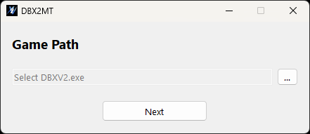
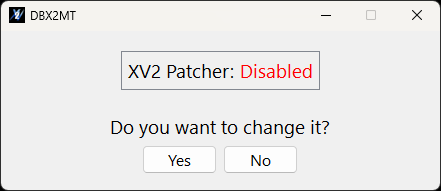

# DBX2MT

**DBX2MT (Dragon Ball Xenoverse 2 Mod Toggle)** is an application that allows you to easily enable or disable mods in *Dragon Ball Xenoverse 2*.

## Features

- Quick enable/disable mod switching.
- Automatically detects the current mod status.
- Saves the game path so you don’t need to set it every time.

## Usage

1. Launch the application.
2. Select the game executable location (`DBXV2.exe`).
3. The app will show whether mods are **enabled** or **disabled**.
4. Click the corresponding button to change the mod state.

## Requirements

- **XV2 Patcher** must be installed.

## Important

If mods are enabled, the game must be launched from:

`...\DB Xenoverse 2\bin\DBXV2.exe`

If mods are disabled, the game can be launched normally via Steam or any standard method.

## Configuration

The application automatically saves the game path in:

`C:\Users\\"YourUser"\AppData\Roaming\DBX2ModToggle\Settings.ini`

## Screenshots

  
  

  <b>Game path selection</b>
  &nbsp;&nbsp;&nbsp;&nbsp;&nbsp;&nbsp;&nbsp;&nbsp;&nbsp;&nbsp;&nbsp;&nbsp;&nbsp;&nbsp;&nbsp;&nbsp;
  <b>Mod enable / disable toggle</b>

